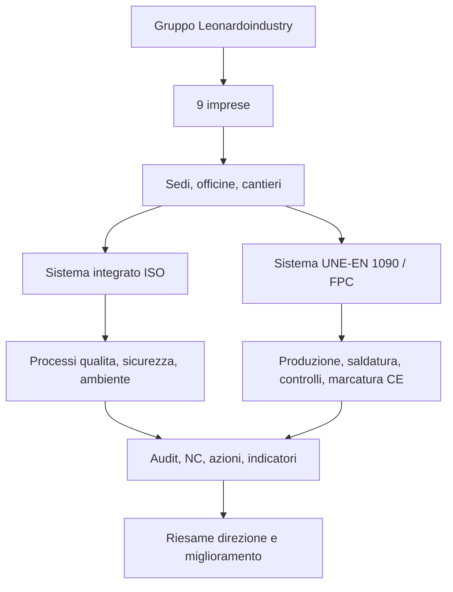
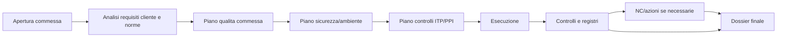

# Architettura app gestione qualita, sicurezza, ambiente e saldatura

Data: 2026-05-24  
Ambito: gruppo Leonardoindustry, 9 imprese  
Norme coperte:
- ISO 9001, gestione qualita;
- ISO 45001, salute e sicurezza sul lavoro;
- ISO 14001, gestione ambientale;
- UNE-EN 1090, esecuzione strutture acciaio/alluminio, marcatura CE, Factory Production Control e saldatura.

Nota: nella richiesta e indicato "ISO 45000"; per l'app si assume ISO 45001, che e la norma certificabile per il sistema di gestione salute e sicurezza sul lavoro.

## 1. Visione dell'app

L'app deve diventare il sistema unico di gestione per:

- documenti e procedure;
- obblighi normativi;
- processi aziendali;
- cantieri e commesse;
- qualita, sicurezza e ambiente;
- controllo produzione secondo UNE-EN 1090;
- saldatura, qualifiche, WPS/WPQR, controlli e tracciabilita;
- audit, non conformita, incidenti, azioni correttive;
- scadenze, reminder e allarmi.

Il principio base e: ogni dato deve essere collegato a impresa, processo, norma, responsabile, scadenza, evidenza e azione.

## 2. Struttura modulare

### 2.1 Modulo gruppo e imprese

Funzioni:
- anagrafica gruppo;
- 9 imprese;
- sedi, stabilimenti, officine, cantieri;
- ruoli e permessi;
- matrice applicabilita norme per impresa.

Ogni impresa puo avere:
- certificazioni proprie;
- processi attivi/non attivi;
- documenti specifici;
- responsabili;
- scadenze;
- cantieri;
- officine e linee produttive.

### 2.2 Modulo norme e requisiti

Questo modulo e il ponte tra norme e processi.

Entita principali:
- norma;
- capitolo/clausola;
- requisito;
- processo collegato;
- documento/procedura collegata;
- evidenza richiesta;
- responsabile;
- stato conformita.

Esempio:

| Norma | Requisito app | Evidenza |
|---|---|---|
| ISO 9001 | controllo documenti, obiettivi, NC, fornitori | procedure, registri, indicatori |
| ISO 45001 | valutazione rischi SSL, formazione, incidenti | DVR/valutazioni, corsi, indagini |
| ISO 14001 | aspetti ambientali, consumi, emergenze | matrice aspetti, registri consumi, prove emergenza |
| UNE-EN 1090 | FPC, EXC, materiali, saldatura, controlli | WPS/WPQR, qualifiche saldatori, ITP/PPI, DoP, CE |

### 2.3 Modulo documentale

Funzioni:
- procedure;
- istruzioni operative;
- moduli;
- registri;
- documenti esterni;
- revisioni;
- approvazioni;
- obsoleti;
- distribuzione controllata.

Stati documento:
- bozza;
- in revisione;
- approvato;
- attivo;
- sospeso;
- obsoleto;
- archiviato.

Allarmi:
- documento in scadenza revisione;
- documento attivo duplicato;
- documento obsoleto usato in cantiere/officina;
- procedura non collegata a norma/processo.

### 2.4 Modulo processi ISO integrati

Processi master:

1. Direzione e riesame
2. Contesto, parti interessate, rischi e opportunita
3. Documentazione
4. Commerciale, clienti e contratti
5. Fornitori e subappaltatori
6. Risorse umane, formazione e competenze
7. Pianificazione commesse e cantieri
8. Produzione e controllo operativo
9. Qualita e controlli
10. Sicurezza e salute sul lavoro
11. Ambiente e consumi
12. Attrezzature, strumenti e veicoli
13. Emergenze e antincendio
14. Incidenti e quasi incidenti
15. Non conformita e azioni
16. Audit
17. Indicatori, obiettivi e miglioramento

### 2.5 Modulo commesse, cantieri e officina

Ogni commessa/cantiere deve avere:
- cliente;
- contratto;
- impresa responsabile;
- responsabile commessa;
- responsabile qualita;
- responsabile sicurezza;
- responsabile ambiente;
- procedure applicabili;
- rischi specifici;
- fornitori/subappaltatori;
- personale assegnato;
- strumenti e attrezzature;
- checklist apertura;
- controlli in corso;
- checklist chiusura;
- dossier finale.

Workflow:

## 3. Modulo UNE-EN 1090 e saldatura

Questo e un modulo specialistico, non un semplice archivio.

### 3.1 Obiettivo

Gestire Factory Production Control, tracciabilita dei materiali, qualifiche, saldature, controlli e dossier tecnico per marcatura CE secondo UNE-EN 1090.

### 3.2 Sotto-moduli

| Sotto-modulo | Funzione |
|---|---|
| FPC | Controllo produzione di fabbrica |
| Classi di esecuzione | EXC1, EXC2, EXC3, EXC4 |
| Materiali | certificati 3.1, colate, lotti, tracciabilita |
| Disegni e revisioni | gestione disegni, revisioni, approvazioni |
| WPS | Welding Procedure Specification |
| WPQR | qualifiche procedure di saldatura |
| Saldatori/operatori | qualifiche, validita, range, processo |
| Coordinamento saldatura | responsabile saldatura, competenze, autorizzazioni |
| Consumabili | elettrodi, fili, gas, lotti, stoccaggio |
| Attrezzature | saldatrici, strumenti, tarature, manutenzioni |
| Piano controlli | ITP/PPI, punti hold/witness/review |
| Controlli dimensionali | tolleranze, misure, evidenze |
| NDT/CND | VT, PT, MT, UT, RT, percentuali e risultati |
| Non conformita saldatura | difetti, riparazioni, ricontrolli |
| Dossier CE | dichiarazione prestazione, etichetta CE, fascicolo tecnico |

### 3.3 Catena saldatura

```mermaid
flowchart LR
  A["Ordine/commessa"] --> B["Classe esecuzione EXC"]
  B --> C["Disegni approvati"]
  C --> D["Materiali certificati"]
  D --> E["WPS applicabile"]
  E --> F["Saldatore qualificato"]
  F --> G["Attrezzatura valida"]
  G --> H["Esecuzione saldatura"]
  H --> I["Controllo visivo VT"]
  I --> J["CND se richiesto"]
  J --> K["NC/riparazione se necessario"]
  K --> L["Ricontrollo"]
  J --> M["Dossier saldatura"]
  L --> M
  M --> N["Dossier CE / consegna"]
```

### 3.4 Controlli automatici del modulo saldatura

Prima di autorizzare una saldatura, l'app deve verificare:

- commessa aperta;
- classe EXC definita;
- disegno in revisione approvata;
- materiale con certificato valido;
- WPS compatibile con processo, materiale, spessore, posizione;
- WPQR collegata alla WPS;
- saldatore qualificato e qualifica non scaduta;
- consumabile corretto e lotto registrato;
- saldatrice disponibile e manutenzione valida;
- strumenti di controllo tarati;
- piano controlli approvato;
- eventuali CND pianificati.

Se manca uno di questi elementi, l'app crea un blocco o un allarme.

### 3.5 Dossier saldatura minimo

Per ogni pezzo/lotto/commessa:

- identificativo commessa;
- impresa;
- cliente;
- disegno e revisione;
- EXC;
- distinta materiali;
- certificati materiali;
- saldature eseguite;
- WPS usata;
- WPQR collegata;
- saldatore;
- data saldatura;
- consumabili e lotti;
- controlli VT;
- controlli CND;
- NC e riparazioni;
- esito finale;
- approvazione responsabile saldatura;
- allegati foto/report.

## 4. Scadenziario e automazioni

### 4.1 Tipi di scadenza

| Tipo | Esempi |
|---|---|
| Documentale | revisione procedura, approvazione documento |
| Personale | formazione, visita medica, qualifica saldatore |
| Fornitore | DURC/documenti, valutazione annuale, certificati |
| Strumenti | tarature, verifiche, manutenzioni |
| Veicoli | revisione, assicurazione |
| Audit | piano, esecuzione, chiusura rilievi |
| Ambiente | consumi, rifiuti, aspetti ambientali |
| Sicurezza | DPI, ispezioni, incidenti, emergenze |
| Saldatura | scadenza WPQR, qualifica saldatore, certificati lotti |
| CE/1090 | riesame FPC, audit FPC, dossier, DoP |

### 4.2 Regole allarme

| Livello | Regola |
|---|---|
| Verde | completato con evidenza |
| Blu | pianificato senza criticita |
| Giallo | scadenza entro 30 giorni |
| Arancione | scadenza entro 7 giorni |
| Rosso | scaduto, mancante o blocco operativo |
| Nero | rischio grave: lavoro non autorizzabile |

### 4.3 Escalation

1. Promemoria al responsabile.
2. Secondo promemoria al responsabile e al capo processo.
3. Escalation alla direzione impresa.
4. Escalation alla direzione gruppo.

## 5. Ruoli utente

| Ruolo | Permessi principali |
|---|---|
| Admin gruppo | vede e configura tutte le imprese |
| Direzione gruppo | dashboard, audit, KPI, escalation |
| Direzione impresa | gestione impresa, approvazioni, riesame |
| Responsabile qualita | documenti, audit, NC, indicatori |
| Responsabile sicurezza | rischi SSL, formazione, incidenti, DPI |
| Responsabile ambiente | aspetti, consumi, rifiuti, emergenze |
| Responsabile saldatura | WPS, saldatori, controlli, dossier |
| Project manager | commesse, cantieri, piani controllo |
| Capo officina/cantiere | esecuzione checklist e registri |
| Operatore/saldatore | attivita assegnate, evidenze, firme |
| Auditor | audit, rilievi, checklist |
| Fornitore/subappaltatore | caricamento documenti richiesti |

## 6. Dashboard principali

### Dashboard gruppo

- stato 9 imprese;
- scadenze rosse/arancioni;
- NC aperte;
- audit pianificati;
- incidenti;
- indicatori principali;
- stato certificazioni;
- stato UNE-EN 1090/FPC;
- saldatori e WPS in scadenza.

### Dashboard impresa

- processi attivi;
- commesse aperte;
- azioni aperte;
- formazione;
- fornitori;
- strumenti;
- ambiente;
- sicurezza;
- dossier saldatura.

### Dashboard commessa/officina

- piano qualita commessa;
- controlli da fare;
- saldature da autorizzare;
- materiali senza certificato;
- saldatori disponibili;
- CND programmati;
- NC tecniche;
- dossier finale.

## 7. Architettura tecnica suggerita

### 7.1 Frontend

Applicazione web responsive:
- dashboard operative;
- tabelle filtrabili;
- schede processo;
- checklist digitali;
- upload evidenze;
- firma/approvazione;
- calendario scadenze;
- viste per ruolo.

### 7.2 Backend

Servizi principali:
- autenticazione e permessi;
- gestione imprese;
- gestione documenti;
- motore workflow;
- motore scadenze/allarmi;
- gestione audit/NC/azioni;
- gestione saldatura/1090;
- reporting;
- importazione documenti Excel/PDF/Word;
- esportazione dossier.

### 7.3 Database

Database relazionale consigliato:
- PostgreSQL per dati strutturati;
- archivio file per allegati;
- indice full-text per cercare documenti ed evidenze.

### 7.4 Motore regole

Il motore regole deve controllare condizioni come:

- "non autorizzare saldatura se qualifica saldatore scaduta";
- "non chiudere commessa se manca dossier finale";
- "non approvare fornitore se documenti obbligatori mancanti";
- "aprire NC se audit trova requisito non conforme";
- "generare reminder 30/7/1 giorni prima della scadenza".

## 8. MVP consigliato

La prima versione deve essere piccola ma utile.

### MVP 1

- anagrafica imprese;
- anagrafica processi;
- gestione documentale base;
- scadenziario;
- dashboard scadenze;
- audit;
- NC e azioni;
- anagrafica persone e formazione;
- anagrafica strumenti;
- modulo saldatura base: WPS, saldatori, qualifiche, controlli.

### MVP 2

- commesse/cantieri;
- piano qualita commessa;
- fornitori/subappaltatori;
- PPI/checklist digitali;
- ambiente e consumi;
- incidenti/emergenze.

### MVP 3

- dossier UNE-EN 1090 completo;
- marcatura CE;
- esportazione fascicolo tecnico;
- report riesame direzione automatico;
- comparazione tra 9 imprese.

## 9. Regola di progettazione

Nessun modulo deve vivere da solo. Ogni record deve avere:

- impresa;
- sede/cantiere/officina se applicabile;
- processo;
- norma/requisito;
- responsabile;
- scadenza;
- stato;
- evidenza;
- azione collegata se non conforme.

