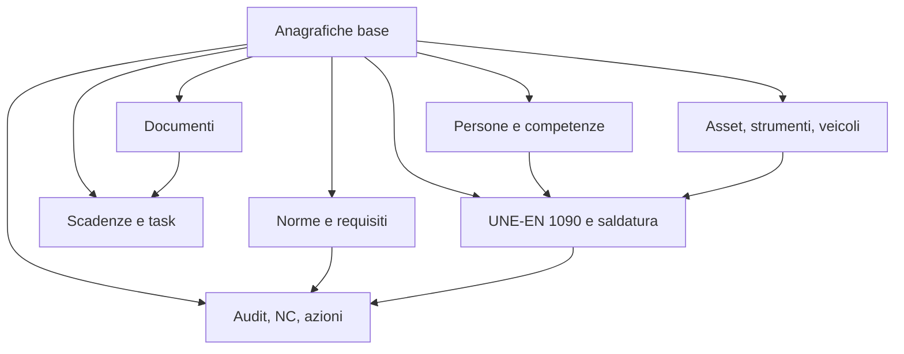

# Istruzioni mirate per creare il database

Database consigliato: PostgreSQL  
App: gestione qualita ISO 9001, sicurezza ISO 45001, ambiente ISO 14001, UNE-EN 1090 e saldatura  
Gruppo: Leonardoindustry, 9 imprese

## 1. Principio obbligatorio

Ogni dato operativo deve essere sempre collegato a:

1. impresa;
2. sede, officina o cantiere, se applicabile;
3. processo;
4. norma/requisito;
5. responsabile;
6. scadenza, se applicabile;
7. evidenza/documento;
8. azione correttiva, se il dato nasce da problema, audit, incidente o NC.

Questo principio deve guidare tutte le tabelle.

## 2. Struttura del database

Il database deve essere diviso in 8 blocchi.

## 3. Blocco 1 - Anagrafiche base

Creare prima queste tabelle:

- `company_group`
- `company`
- `site`
- `role`
- `person`
- `process`

Regole:

- `company_group` contiene il gruppo Leonardoindustry.
- `company` contiene le 9 imprese.
- `site` contiene sedi, officine, cantieri, magazzini.
- `process` contiene i processi master.
- `person` deve essere collegata a una impresa.
- `role` deve definire i ruoli gestionali: direzione, qualita, sicurezza, ambiente, saldatura, project manager, auditor, operatore.

Processi iniziali da caricare:

1. Direzione e riesame
2. Documentazione
3. Rischi e opportunita
4. Clienti e contratti
5. Fornitori e subappalti
6. Risorse umane e formazione
7. Commesse e cantieri
8. Produzione e controllo operativo
9. Qualita e controlli
10. Sicurezza
11. Ambiente
12. Infrastrutture e strumenti
13. Emergenze e antincendio
14. Incidenti
15. Non conformita e azioni
16. Audit
17. Indicatori e obiettivi
18. UNE-EN 1090 e saldatura

## 4. Blocco 2 - Norme e requisiti

Creare:

- `standard`
- `standard_requirement`
- `process_requirement`

Norme iniziali:

- ISO 9001
- ISO 45001
- ISO 14001
- UNE-EN 1090-1
- UNE-EN 1090-2
- ISO 3834, se si vuole gestire la qualita della saldatura in modo piu completo
- ISO 9606, qualifiche saldatori
- ISO 15614, qualifiche procedure di saldatura
- ISO 15609, WPS

Regole:

- ogni requisito normativo deve avere almeno una sintesi operativa;
- ogni requisito deve essere collegabile a uno o piu processi;
- ogni processo deve mostrare quali norme copre;
- deve essere possibile indicare `applicabile`, `non applicabile`, `parziale`.

## 5. Blocco 3 - Documenti

Creare:

- `document`
- `document_revision`
- `file_attachment`

Regole:

- un documento puo essere di gruppo o di singola impresa;
- un documento deve avere codice, titolo, tipo, stato e processo;
- una sola revisione puo essere corrente;
- i documenti obsoleti non devono essere selezionabili nei flussi operativi;
- ogni file caricato deve stare in `file_attachment`.

Tipi documento:

- procedura;
- istruzione operativa;
- modulo;
- registro;
- certificato;
- disegno;
- WPS;
- WPQR;
- rapporto controllo;
- dossier;
- documento esterno.

Stati documento:

- bozza;
- in_revisione;
- attivo;
- sospeso;
- obsoleto;
- archiviato.

## 6. Blocco 4 - Scadenze, task e reminder

Creare:

- `task`
- `reminder`

Regole:

- ogni scadenza deve generare un task;
- ogni task deve avere responsabile e data;
- se il task supera la data, diventa `scaduto`;
- generare reminder automatici a 30, 7 e 1 giorni;
- i task critici devono poter bloccare un processo operativo.

Origini task:

- documento;
- audit;
- non conformita;
- azione correttiva;
- formazione;
- visita medica;
- fornitore;
- strumento;
- veicolo;
- saldatura;
- WPS/WPQR;
- qualifica saldatore;
- cantiere;
- ambiente;
- sicurezza.

## 7. Blocco 5 - Audit, NC e azioni

Creare:

- `audit`
- `audit_checklist`
- `audit_finding`
- `non_conformity`
- `corrective_action`

Regole:

- una NC puo nascere da audit, controllo, cliente, fornitore, saldatura, incidente o controllo interno;
- una NC non puo essere chiusa senza azione;
- una azione non puo essere chiusa senza verifica efficacia;
- ogni NC deve avere gravita;
- ogni audit deve essere collegato a norma, processo e impresa.

Stati NC:

- aperta;
- analisi_causa;
- azione_definita;
- in_verifica;
- chiusa.

Stati azione:

- aperta;
- in_corso;
- completata;
- efficace;
- non_efficace.

## 8. Blocco 6 - Persone, formazione e competenze

Creare:

- `competence`
- `person_competence`
- `training_event`

Regole:

- ogni persona puo avere piu competenze;
- ogni competenza puo avere scadenza;
- una qualifica scaduta deve bloccare l’assegnazione a lavori critici;
- le qualifiche saldatori devono essere gestite anche nel modulo saldatura.

Competenze iniziali:

- responsabile qualita;
- responsabile sicurezza;
- responsabile ambiente;
- auditor interno;
- project manager;
- saldatore 111;
- saldatore 135;
- saldatore 136;
- controllo visivo VT;
- addetto emergenze;
- addetto antincendio;
- uso attrezzature specifiche.

## 9. Blocco 7 - Asset, strumenti, veicoli e attrezzature

Creare:

- `asset`
- `asset_event`

Regole:

- ogni asset deve avere codice interno;
- se e strumento di misura deve avere taratura/verifica;
- se e saldatrice deve avere manutenzione/verifica;
- se e veicolo deve avere revisione e assicurazione;
- asset scaduto o fuori servizio non deve essere utilizzabile in commessa.

Tipi asset:

- strumento di misura;
- saldatrice;
- attrezzatura;
- veicolo;
- estintore;
- DPI;
- macchina/officina;
- altro.

Eventi asset:

- taratura;
- verifica;
- manutenzione;
- revisione;
- riparazione;
- fuori_servizio;
- rientro_servizio.

## 10. Blocco 8 - UNE-EN 1090 e saldatura

Creare:

- `execution_class`
- `welding_process`
- `wps`
- `wpqr`
- `welder_qualification`
- `material_lot`
- `project`
- `drawing`
- `weld`
- `weld_inspection`
- `ce_dossier`

Regole fondamentali:

1. Non autorizzare una saldatura senza commessa.
2. Non autorizzare una saldatura senza classe EXC.
3. Non autorizzare una saldatura senza disegno approvato.
4. Non autorizzare una saldatura senza materiale identificato.
5. Non autorizzare una saldatura senza certificato materiale, quando richiesto.
6. Non autorizzare una saldatura senza WPS valida.
7. Non autorizzare una saldatura senza WPQR collegata alla WPS.
8. Non autorizzare una saldatura se il saldatore non e qualificato.
9. Non autorizzare una saldatura se la qualifica del saldatore e scaduta.
10. Non chiudere una saldatura senza controllo VT.
11. Non chiudere una saldatura con CND richiesto ma non eseguito.
12. Non chiudere il dossier CE se ci sono NC aperte.

Classi EXC:

- EXC1
- EXC2
- EXC3
- EXC4

Processi saldatura iniziali:

- 111, elettrodo rivestito;
- 135, MAG filo pieno;
- 136, MAG filo animato;
- 141, TIG.

Controlli saldatura:

- VT, controllo visivo;
- PT, liquidi penetranti;
- MT, magnetoscopico;
- UT, ultrasuoni;
- RT, radiografico;
- dimensionale.

## 11. Ordine corretto di creazione

Creare le tabelle in questo ordine:

1. tipi enum;
2. `company_group`;
3. `company`;
4. `site`;
5. `role`;
6. `person`;
7. `process`;
8. `standard`;
9. `standard_requirement`;
10. `process_requirement`;
11. `file_attachment`;
12. `document`;
13. `document_revision`;
14. `task`;
15. `reminder`;
16. `audit`;
17. `audit_checklist`;
18. `audit_finding`;
19. `non_conformity`;
20. `corrective_action`;
21. `competence`;
22. `person_competence`;
23. `training_event`;
24. `asset`;
25. `asset_event`;
26. `execution_class`;
27. `welding_process`;
28. `project`;
29. `drawing`;
30. `wps`;
31. `wpqr`;
32. `welder_qualification`;
33. `material_lot`;
34. `weld`;
35. `weld_inspection`;
36. `ce_dossier`.

## 12. Campi tecnici obbligatori

Ogni tabella importante deve avere:

- `id uuid primary key`;
- `created_at timestamp`;
- `updated_at timestamp`;
- `created_by uuid`;
- `updated_by uuid`;
- `active boolean`;

Per tabelle operative aggiungere:

- `company_id`;
- `site_id`, se applicabile;
- `process_id`, se applicabile;
- `status`;
- `notes`.

## 13. Indici obbligatori

Creare indici su:

- `company_id`;
- `site_id`;
- `process_id`;
- `status`;
- `due_date`;
- `responsible_id`;
- `standard_id`;
- `document.code`;
- `document.status`;
- `wps.code`;
- `welder_qualification.person_id`;
- `welder_qualification.expiry_date`;
- `asset.serial_number`;
- `asset_event.next_due_date`;
- `weld.project_id`;
- `weld.status`.

## 14. Regole di qualita dati

Il database deve impedire:

- documenti senza codice;
- task senza responsabile;
- task senza scadenza;
- NC senza descrizione;
- azioni senza responsabile;
- WPS senza processo saldatura;
- WPQR senza WPS;
- qualifica saldatore senza saldatore;
- saldatura senza WPS;
- saldatura senza saldatore;
- saldatura senza commessa;
- dossier CE senza commessa.

## 15. Prima importazione dati

Importare dall’archivio attuale in questo ordine:

1. elenco documenti da `inventario_sistema_qualita.csv`;
2. procedure P-01/P-25;
3. processi da `PROCESOS.xlsx`;
4. indicatori;
5. rischi e opportunita;
6. fornitori/subappalti;
7. persone e formazione;
8. strumenti e veicoli;
9. WPS/WPQR e qualifiche saldatori, se presenti;
10. audit;
11. NC e azioni.

Durante importazione:

- non cancellare file originali;
- salvare sempre percorso origine;
- classificare come `attivo/da verificare` se non si e certi;
- classificare `OLD`, `obsoleto`, `años anteriores` come storico/obsoleto;
- richiedere conferma umana prima di rendere un documento attivo.

