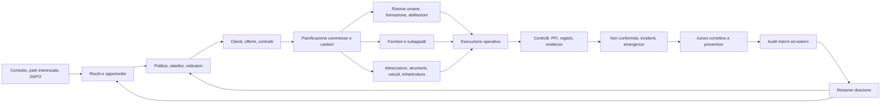
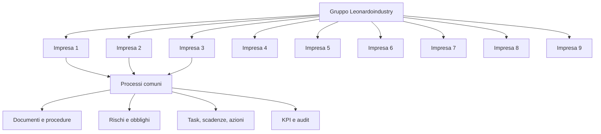
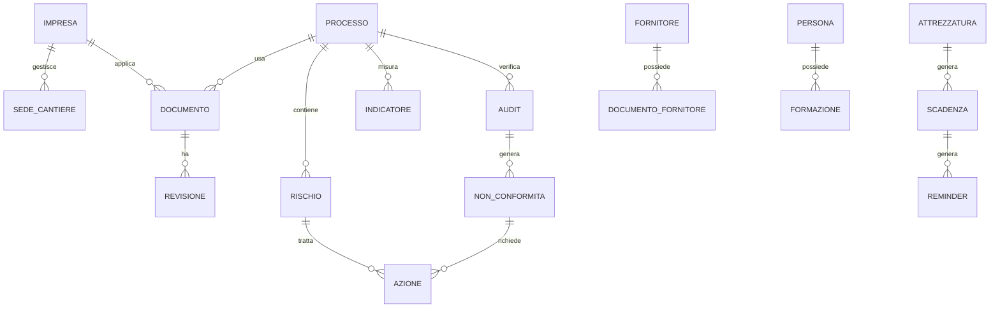

# Mappa di gestione del Sistema Qualita Leonardoindustry

Origine analisi: `C:\Users\christiancapuano\Desktop\qualita`  
Data mappa: 2026-05-24  
Archivio letto: 625 file, con 322 PDF, 149 DOCX, 42 DOC, 39 XLSX, 23 XLS, immagini, messaggi e archivi.  
Sistema base rilevato: ENEMEK, con procedure P-01/P-25, evidenze annuali, registri operativi e cartelle storiche/obsolete.

## 1. Obiettivo della futura app

Creare una piattaforma unica per gestire automaticamente il sistema qualita, ambiente, sicurezza e operativo di tutte le 9 imprese del gruppo Leonardoindustry.

L'app deve:

- centralizzare procedure, registri, prove, documenti legali, audit, scadenze e azioni;
- distinguere chiaramente documenti attivi, obsoleti, storici e bozze;
- generare reminder, allarmi, escalation e task automatici;
- collegare ogni evidenza alla procedura, al processo, al responsabile, all'impresa, al cantiere e alla scadenza;
- semplificare il sistema riducendo duplicazioni, vecchie revisioni e file dispersi;
- permettere una gestione comune di gruppo, mantenendo particolarita per ogni impresa.

## 2. Architettura logica generale

Il sistema qualita deve essere trattato come una catena gestionale, non come archivio documentale.

## 3. Categorie rilevate nell'archivio

| Area | Cartelle/procedure principali | Funzione gestionale |
|---|---|---|
| Guida del sistema | 0-GUIA DEL SISTEMA, politica, obiettivi, riesame, requisiti legali, indicatori, comunicazioni, soddisfazione cliente | Governance del sistema integrato |
| Documentazione | P-01, informazione documentata, elenco procedure | Controllo revisioni, distribuzione, approvazioni, obsoleti |
| Rischi e opportunita | P-02, DAFO, parti interessate, analisi rischi 2024/2025 | Valutazione rischi, azioni, riesame |
| Fornitori e subappalti | P-03, P-03.1, elenco fornitori, subcontratas Italia | Qualifica, monitoraggio, rivalutazione, documenti obbligatori |
| Risorse umane | P-04, formazione, mansioni, abilitazioni | Competenze, onboarding, formazione, idoneita |
| Clienti | P-05, soddisfazione cliente, offerte/contratti | Requisiti, preventivi, modifiche, feedback |
| Opere/cantieri | P-06, pianificazione e controllo opere | Pianificazione lavori, controlli, comunicazioni cliente |
| NC e azioni correttive | P-07, quadro NC, NC 2025 | Apertura, analisi cause, azioni, chiusura |
| Infrastruttura e strumenti | P-08, strumenti, veicoli, estintori, scale, generatori, strumenti misura | Inventario, manutenzione, tarature, revisioni |
| Ambiente | P-09, consumi, rifiuti, aspetti ambientali | Identificazione aspetti, valutazione, controlli ambientali |
| Audit | P-10, piani, programmi, audit 2020-2025 | Programmazione, checklist, rilievi, follow-up |
| Emergenze | P-11, piani emergenza, simulazioni, schede | Preparazione e risposta a emergenze |
| Controllo operativo | P-12, consumi, rifiuti, emissioni, rumori, opere | Monitoraggio operativo ambientale |
| Antincendio | P-13, estintori, PCI | Ispezioni, manutenzioni e scadenze antincendio |
| Incidenti | P-14, incidenti/accidenti | Registrazione, indagine, prevenzione recidive |
| Procedure operative | P-15/P-25 | Prove, cavi, connessioni, hincado, cerramiento, officina, strutture metalliche, saldatura, design |
| Prevenzione PRL | Piano PREVING, procedure preventive | Sicurezza lavoro, coordinamento, DPI, sorveglianza sanitaria |
| ISO opere | Guida ISO ENEMEK Obras | Pacchetto procedure di cantiere |

## 4. Catena gestionale dei processi

### 4.1 Governance

Input:
- contesto aziendale, parti interessate, requisiti legali, politica, audit precedenti;
- analisi DAFO e rischi/opportunita;
- risultati indicatori, NC, incidenti, reclami, soddisfazione cliente.

Output:
- obiettivi annuali;
- indicatori per processo;
- piano audit;
- decisioni di riesame;
- azioni di miglioramento.

Automazioni:
- reminder annuale per aggiornare DAFO, parti interessate, rischi e opportunita;
- allarme se un obiettivo annuale non ha responsabile, scadenza, stato o evidenza;
- allarme se indicatori mensili/trimestrali non sono aggiornati;
- task automatico da riesame direzione verso responsabili.

### 4.2 Documentazione e revisioni

Input:
- nuove procedure, revisioni, allegati, documenti esterni, registri compilati.

Controlli:
- codice documento;
- revisione;
- data approvazione;
- responsabile revisione;
- stato: bozza, attivo, superato, obsoleto, archiviato;
- processo collegato;
- imprese applicabili.

Output:
- elenco documenti controllati;
- elenco procedure attive;
- storico revisioni;
- distribuzione controllata.

Automazioni:
- allarme se esistono due documenti attivi con stesso codice e revisione differente;
- promemoria revisione periodica, suggerita ogni 12 mesi;
- blocco uso operativo di documenti in cartelle OLD/obsoleto;
- notifica agli utenti quando una procedura cambia.

### 4.3 Commerciale, cliente e commessa

Catena:
1. richiesta cliente;
2. verifica requisiti cliente, legali, tecnici e qualita;
3. preventivo/offerta;
4. accettazione e contratto;
5. apertura commessa/cantiere;
6. pianificazione lavori;
7. scelta personale, fornitori, attrezzature;
8. controlli operativi e consegna;
9. soddisfazione cliente;
10. eventuali NC/reclami e azioni.

Automazioni:
- checklist apertura commessa;
- controllo documenti minimi prima di iniziare lavori;
- reminder invio sondaggio soddisfazione cliente dopo chiusura lavoro;
- allarme se un requisito cliente non ha evidenza di verifica.

### 4.4 Fornitori e subappaltatori

Catena:
1. richiesta acquisto o subappalto;
2. qualifica iniziale;
3. verifica documentazione obbligatoria;
4. ordine/contratto;
5. ingresso in cantiere o fornitura;
6. controllo prestazione;
7. rivalutazione;
8. eventuale NC fornitore.

Automazioni:
- scadenza documenti fornitore/subappaltatore;
- allarme documento mancante prima dell'accesso a cantiere;
- rivalutazione annuale;
- punteggio fornitore per NC, ritardi, conformita, documentazione.

### 4.5 Risorse umane e formazione

Catena:
1. definizione mansione;
2. competenze richieste;
3. inserimento personale;
4. formazione iniziale;
5. abilitazioni specifiche;
6. assegnazione a commessa;
7. formazione periodica;
8. sostituzione ruoli chiave.

Automazioni:
- scadenza corsi, patentini, visite mediche, formazione PRL;
- blocco assegnazione a lavori critici se manca competenza;
- reminder campagna formativa trimestrale;
- matrice competenze per impresa, persona, mansione, cantiere.

### 4.6 Infrastrutture, strumenti e veicoli

Catena:
1. censimento bene;
2. identificazione codice/seriale;
3. assegnazione;
4. manutenzione preventiva;
5. taratura/verifica;
6. utilizzo in opera;
7. anomalia o fuori servizio;
8. riparazione o dismissione.

Automazioni:
- scadenze tarature strumenti;
- revisioni veicoli, assicurazioni, ITV;
- controlli estintori e antincendio;
- manutenzioni periodiche;
- allarme uso strumento scaduto in registro di prova.

### 4.7 Operazioni di cantiere e produzione

Processi operativi rilevati:
- P-15 strumenti di ispezione, misura e prova;
- P-16 resistenza isolamento e continuita;
- P-17 posa/tendido cavi;
- P-18 connessioni cavi;
- P-19 hincado;
- P-20 cerramiento;
- P-21 officina/taller;
- P-22 strutture metalliche;
- P-23 saldatura elettrodo;
- P-24 saldatura filo;
- P-25 design e sviluppo.

Catena:
1. apertura attivita;
2. prerequisiti tecnici, disegni, revisioni, PPI;
3. personale abilitato;
4. mezzi e strumenti validi;
5. esecuzione;
6. controlli;
7. registrazione evidenze;
8. approvazione cliente/direzione lavori;
9. chiusura;
10. lezioni apprese.

Automazioni:
- checklist per procedura operativa;
- controllo automatico: documento tecnico in revisione valida;
- PPI digitale con firma;
- allegati foto, PDF, strumenti usati, operatori;
- allarme se manca registrazione controllo prima della chiusura lavoro.

### 4.8 Ambiente, sicurezza, emergenze, incidenti

Catena ambiente:
1. identificazione aspetto ambientale;
2. valutazione significativita;
3. controllo operativo;
4. monitoraggio consumi/rifiuti/emissioni;
5. emergenza o incidente ambientale;
6. azione correttiva;
7. riesame.

Catena sicurezza:
1. valutazione rischio;
2. piano prevenzione;
3. formazione;
4. DPI;
5. autorizzazioni;
6. ispezioni;
7. incidente/quasi incidente;
8. indagine;
9. azioni.

Automazioni:
- consumo mensile gasolio, luce, acqua, carta, toner;
- alert se consumo supera soglia o trend definito;
- simulazione emergenza programmata;
- scadenza revisioni estintori;
- investigazione incidente entro termine definito;
- verifica efficacia azione correttiva.

### 4.9 Audit, NC e miglioramento

Catena:
1. piano audit annuale;
2. programma audit;
3. checklist per processo;
4. rilevazione NC/osservazioni/opportunita;
5. assegnazione azioni;
6. verifica attuazione;
7. verifica efficacia;
8. chiusura;
9. input al riesame direzione.

Automazioni:
- reminder 60/30/7 giorni prima audit;
- scadenza azioni correttive;
- escalation a direzione se azione scaduta;
- dashboard NC aperte per processo, impresa, responsabile, gravita;
- collegamento diretto tra NC, causa, azione, evidenza e verifica efficacia.

## 5. Modello multi-impresa per le 9 societa

La futura app deve usare una struttura gruppo/societa/processo:

Ogni dato deve avere questi campi minimi:

| Campo | Scopo |
|---|---|
| Gruppo | Leonardoindustry |
| Impresa | Una delle 9 societa |
| Sede/cantiere | Dove si applica |
| Processo | Qualita, sicurezza, ambiente, operativo, HR, fornitori, ecc. |
| Procedura collegata | P-xx o documento esterno |
| Responsabile | Persona o ruolo |
| Frequenza | Mensile, trimestrale, annuale, evento |
| Scadenza | Data controllabile |
| Stato | Aperto, in corso, scaduto, chiuso, verificato |
| Evidenza | File, foto, modulo, firma, link |
| Rischio collegato | Se applicabile |
| NC/azione collegata | Se applicabile |

## 6. Moduli della futura app

| Modulo | Funzione | Priorita |
|---|---|---|
| Dashboard gruppo | Stato delle 9 imprese, scadenze, NC, audit, KPI | Alta |
| Gestione documentale | Procedure, revisioni, obsoleti, approvazioni | Alta |
| Scadenziario automatico | Reminder, allarmi, escalation | Alta |
| Processi e checklist | Catene operative per ogni processo | Alta |
| Audit | Piano, programma, checklist, rilievi, azioni | Alta |
| NC e azioni | Apertura, cause, azioni, verifiche efficacia | Alta |
| Fornitori/subappalti | Qualifica, documenti, valutazioni | Alta |
| HR e formazione | Competenze, corsi, scadenze, idoneita | Alta |
| Attrezzature/veicoli | Inventario, manutenzioni, tarature, revisioni | Alta |
| Ambiente e consumi | Aspetti, rifiuti, consumi, indicatori | Media |
| Cantieri/commesse | Apertura cantiere, PPI, evidenze, chiusura | Alta |
| Emergenze/incidenti | Piano, simulazioni, indagini, azioni | Media |
| Riesame direzione | Raccolta automatica input e output | Media |
| Report ISO | Esportazione evidenze per audit/certificazione | Alta |

## 7. Allarmi e reminder consigliati

| Tipo allarme | Regola |
|---|---|
| Rosso | Scadenza superata o documento obbligatorio mancante |
| Arancione | Scadenza entro 7 giorni |
| Giallo | Scadenza entro 30 giorni |
| Blu | Attivita programmata ma non ancora assegnata |
| Verde | Attivita chiusa con evidenza valida |

Scadenze da automatizzare subito:

- revisione annuale rischi/opportunita;
- aggiornamento DAFO;
- revisione parti interessate;
- obiettivi annuali e loro avanzamento;
- indicatori mensili/trimestrali;
- piano audit annuale;
- audit interni;
- azioni correttive;
- valutazione fornitori;
- documenti subappaltatori;
- formazione e visite mediche;
- tarature strumenti;
- manutenzioni attrezzature;
- revisioni veicoli e assicurazioni;
- controlli estintori/PCI;
- simulazioni emergenza;
- indagini incidenti;
- soddisfazione cliente.

## 8. Semplificazioni necessarie

1. Un solo elenco master documenti per tutto il gruppo.
2. Un solo codice documento, con versione, impresa applicabile e stato.
3. Separazione netta tra "attivo", "storico" e "obsoleto".
4. Procedura P-03 e P-03.1 da collegare in un unico flusso fornitori/subappalti.
5. Procedure P-15/P-18 da trasformare in checklist digitali operative.
6. Registro unico scadenze per HR, strumenti, veicoli, fornitori, audit, ambiente.
7. Un modello comune di NC/azione per qualita, sicurezza, ambiente e fornitori.
8. Dashboard per direzione con pochi indicatori: scaduti, NC aperte, audit, formazione, strumenti, fornitori, incidenti, obiettivi.
9. Archivio evidenze collegato al processo, non solo alla cartella.

## 9. Miglioramenti suggeriti

| Problema rilevato | Miglioramento |
|---|---|
| Molti documenti duplicati tra cartelle operative e guida ISO | Repository unico con collegamenti, non copie |
| Presenza di cartelle OLD/obsoleto vicine ai documenti attivi | Area archivio separata con accesso controllato |
| Registri Excel dispersi | Database unico con import iniziale da Excel |
| Scadenze nascoste nei file | Estrazione date e generazione task automatici |
| Procedure lunghe e poco operative | Checklist digitali per uso quotidiano |
| Sistema nato su una impresa | Campo obbligatorio "impresa" e "sede/cantiere" |
| Azioni non sempre collegate a rischi/NC/audit | Ogni azione deve avere origine, responsabile, data e verifica efficacia |
| Evidenze fotografiche e PDF sparse | Allegati con tag: bene, cantiere, procedura, data, responsabile |

## 10. Oggetti dati principali dell'app

Entita minime:

- Impresa
- Sede/cantiere
- Processo
- Procedura/documento
- Revisione documento
- Registro/evidenza
- Persona
- Ruolo
- Formazione/abilitazione
- Fornitore/subappaltatore
- Attrezzatura/veicolo/strumento
- Scadenza
- Reminder/allarme
- Audit
- Non conformita
- Azione correttiva/preventiva/miglioramento
- Indicatore
- Obiettivo
- Rischio/opportunita
- Requisito legale
- Cliente/contratto/commessa

## 11. Priorita di implementazione

### Fase 1 - Fondazione

- import archivio attuale;
- creazione elenco documenti controllati;
- classificazione attivo/obsoleto/storico;
- anagrafica 9 imprese;
- anagrafica processi;
- scadenziario unico.

### Fase 2 - Controllo operativo

- checklist digitali per audit, cantiere, strumenti, fornitori, HR;
- dashboard scadenze e allarmi;
- gestione NC e azioni;
- gestione evidenze.

### Fase 3 - Miglioramento automatico

- suggerimenti automatici da NC ricorrenti;
- alert trend indicatori;
- report riesame direzione automatico;
- pacchetto audit ISO esportabile;
- confronto tra imprese del gruppo.

## 12. Prima configurazione consigliata

Processi master:

1. Direzione e riesame
2. Documentazione
3. Rischi, opportunita e parti interessate
4. Commerciale e clienti
5. Fornitori e subappalti
6. Risorse umane e formazione
7. Pianificazione commesse/cantieri
8. Esecuzione operativa
9. Controllo qualita e PPI
10. Infrastrutture, strumenti e veicoli
11. Ambiente e consumi
12. Sicurezza e prevenzione
13. Emergenze e antincendio
14. Incidenti e quasi incidenti
15. Non conformita e azioni
16. Audit
17. Indicatori e obiettivi

## 13. Regola chiave

Ogni elemento del sistema deve rispondere a 7 domande:

1. A quale impresa appartiene?
2. A quale processo appartiene?
3. Quale procedura lo governa?
4. Chi e responsabile?
5. Quando scade o quando deve essere rivisto?
6. Quale evidenza dimostra la conformita?
7. Se non e conforme, quale azione lo chiude?

Questa regola trasforma il sistema qualita da archivio a motore di gestione.

