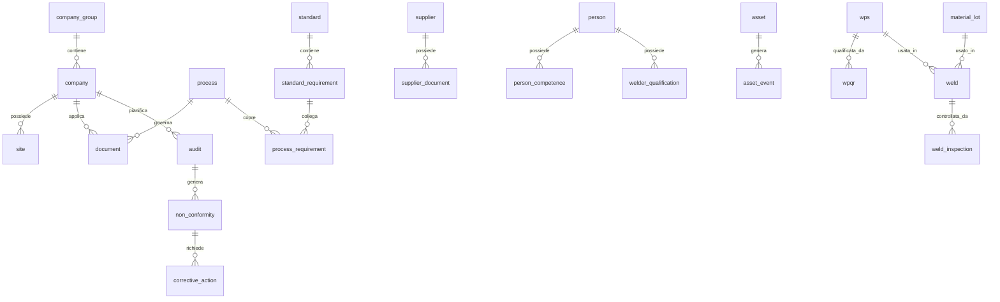

# Modello dati iniziale

Questo modello e la base per costruire database, API e schermate dell'app.

## 1. Tabelle core

### company_group

| Campo | Tipo | Note |
|---|---|---|
| id | uuid | Identificativo gruppo |
| name | text | Leonardoindustry |
| active | boolean | Stato |

### company

| Campo | Tipo | Note |
|---|---|---|
| id | uuid | Identificativo impresa |
| group_id | uuid | Collegamento gruppo |
| name | text | Nome impresa |
| country | text | Paese |
| tax_id | text | Identificativo fiscale |
| active | boolean | Stato |

### site

| Campo | Tipo | Note |
|---|---|---|
| id | uuid | Sede, officina o cantiere |
| company_id | uuid | Impresa |
| type | enum | sede, officina, cantiere, magazzino |
| name | text | Nome |
| address | text | Indirizzo |
| active | boolean | Stato |

### process

| Campo | Tipo | Note |
|---|---|---|
| id | uuid | Processo |
| code | text | Esempio PROC-QUAL-01 |
| name | text | Nome processo |
| category | enum | qualita, sicurezza, ambiente, operativo, saldatura, direzione |
| owner_role_id | uuid | Ruolo responsabile |

### standard

| Campo | Tipo | Note |
|---|---|---|
| id | uuid | Norma |
| code | text | ISO 9001, ISO 45001, ISO 14001, UNE-EN 1090 |
| version | text | Edizione/applicazione |
| title | text | Titolo |
| active | boolean | Stato |

### standard_requirement

| Campo | Tipo | Note |
|---|---|---|
| id | uuid | Requisito |
| standard_id | uuid | Norma |
| clause | text | Clausola/capitolo |
| title | text | Titolo requisito |
| requirement_summary | text | Sintesi operativa |
| evidence_expected | text | Evidenze richieste |

### process_requirement

| Campo | Tipo | Note |
|---|---|---|
| id | uuid | Collegamento |
| process_id | uuid | Processo |
| requirement_id | uuid | Requisito normativo |
| applicability | enum | applicabile, non_applicabile, parziale |
| notes | text | Motivazione |

## 2. Documenti e revisioni

### document

| Campo | Tipo | Note |
|---|---|---|
| id | uuid | Documento |
| company_id | uuid | Null se documento di gruppo |
| process_id | uuid | Processo |
| code | text | P-01, P-02, ecc. |
| title | text | Titolo |
| type | enum | procedura, istruzione, modulo, registro, esterno |
| status | enum | bozza, attivo, obsoleto, archiviato |
| owner_id | uuid | Responsabile |
| review_frequency_months | integer | Frequenza revisione |

### document_revision

| Campo | Tipo | Note |
|---|---|---|
| id | uuid | Revisione |
| document_id | uuid | Documento |
| revision | text | Rev/edizione |
| issue_date | date | Data emissione |
| approved_by | uuid | Approvatore |
| file_id | uuid | File |
| is_current | boolean | Revisione attiva |

## 3. Scadenze, reminder e azioni

### task

| Campo | Tipo | Note |
|---|---|---|
| id | uuid | Attivita |
| company_id | uuid | Impresa |
| site_id | uuid | Sede/cantiere/officina |
| process_id | uuid | Processo |
| source_type | enum | audit, nc, documento, saldatura, formazione, strumento, fornitore |
| source_id | uuid | Origine |
| title | text | Titolo |
| responsible_id | uuid | Responsabile |
| due_date | date | Scadenza |
| priority | enum | bassa, media, alta, critica |
| status | enum | aperta, in_corso, scaduta, chiusa, verificata |

### reminder

| Campo | Tipo | Note |
|---|---|---|
| id | uuid | Reminder |
| task_id | uuid | Attivita |
| remind_at | timestamp | Data promemoria |
| channel | enum | app, email, teams |
| sent_at | timestamp | Invio |

### corrective_action

| Campo | Tipo | Note |
|---|---|---|
| id | uuid | Azione |
| company_id | uuid | Impresa |
| source_type | enum | nc, audit, incidente, rischio, miglioramento |
| source_id | uuid | Origine |
| root_cause | text | Causa |
| action_plan | text | Piano |
| responsible_id | uuid | Responsabile |
| due_date | date | Scadenza |
| effectiveness_check | text | Verifica efficacia |
| status | enum | aperta, in_corso, chiusa, efficace, non_efficace |

## 4. Audit e non conformita

### audit

| Campo | Tipo | Note |
|---|---|---|
| id | uuid | Audit |
| company_id | uuid | Impresa |
| site_id | uuid | Sede/cantiere/officina |
| standard_id | uuid | Norma |
| audit_type | enum | interno, esterno, cliente, fornitore, fpc |
| planned_date | date | Data prevista |
| executed_date | date | Data eseguita |
| lead_auditor_id | uuid | Auditor |
| status | enum | pianificato, eseguito, chiuso |

### non_conformity

| Campo | Tipo | Note |
|---|---|---|
| id | uuid | NC |
| company_id | uuid | Impresa |
| process_id | uuid | Processo |
| requirement_id | uuid | Requisito |
| audit_id | uuid | Audit se presente |
| severity | enum | minore, maggiore, critica |
| description | text | Descrizione |
| detected_at | date | Data rilevazione |
| responsible_id | uuid | Responsabile |
| status | enum | aperta, analisi, azione, verifica, chiusa |

## 5. Persone, formazione e competenze

### person

| Campo | Tipo | Note |
|---|---|---|
| id | uuid | Persona |
| company_id | uuid | Impresa |
| first_name | text | Nome |
| last_name | text | Cognome |
| role_id | uuid | Ruolo |
| active | boolean | Stato |

### competence

| Campo | Tipo | Note |
|---|---|---|
| id | uuid | Competenza |
| name | text | Esempio saldatore MAG, auditor interno |
| category | enum | qualita, sicurezza, ambiente, saldatura, operativo |
| requires_expiry | boolean | Ha scadenza |

### person_competence

| Campo | Tipo | Note |
|---|---|---|
| id | uuid | Competenza persona |
| person_id | uuid | Persona |
| competence_id | uuid | Competenza |
| certificate_file_id | uuid | Attestato |
| issue_date | date | Emissione |
| expiry_date | date | Scadenza |
| status | enum | valida, in_scadenza, scaduta, sospesa |

## 6. Fornitori e subappaltatori

### supplier

| Campo | Tipo | Note |
|---|---|---|
| id | uuid | Fornitore |
| company_id | uuid | Impresa che lo usa |
| name | text | Ragione sociale |
| supplier_type | enum | fornitore, subappaltatore, laboratorio, ente |
| qualification_status | enum | da_valutare, qualificato, sospeso, non_qualificato |
| last_evaluation_date | date | Ultima valutazione |
| next_evaluation_date | date | Prossima valutazione |

### supplier_document

| Campo | Tipo | Note |
|---|---|---|
| id | uuid | Documento fornitore |
| supplier_id | uuid | Fornitore |
| document_type | text | DURC, certificato, assicurazione, ecc. |
| file_id | uuid | File |
| expiry_date | date | Scadenza |
| status | enum | valido, in_scadenza, scaduto, mancante |

## 7. Strumenti, attrezzature e veicoli

### asset

| Campo | Tipo | Note |
|---|---|---|
| id | uuid | Bene |
| company_id | uuid | Impresa |
| site_id | uuid | Sede/officina/cantiere |
| asset_type | enum | strumento, attrezzatura, veicolo, antincendio, saldatrice |
| code | text | Codice interno |
| serial_number | text | Matricola |
| status | enum | disponibile, assegnato, fuori_servizio, dismesso |

### asset_event

| Campo | Tipo | Note |
|---|---|---|
| id | uuid | Evento |
| asset_id | uuid | Bene |
| event_type | enum | taratura, manutenzione, revisione, verifica, riparazione |
| event_date | date | Data |
| next_due_date | date | Prossima scadenza |
| file_id | uuid | Certificato/evidenza |
| result | enum | conforme, non_conforme, limitato |

## 8. Modulo saldatura e UNE-EN 1090

### execution_class

| Campo | Tipo | Note |
|---|---|---|
| id | uuid | Classe |
| code | enum | EXC1, EXC2, EXC3, EXC4 |
| description | text | Descrizione |

### welding_process

| Campo | Tipo | Note |
|---|---|---|
| id | uuid | Processo saldatura |
| code | text | 111, 135, 136, 141, ecc. |
| name | text | Elettrodo, MAG, TIG, ecc. |

### wps

| Campo | Tipo | Note |
|---|---|---|
| id | uuid | WPS |
| company_id | uuid | Impresa |
| code | text | Codice WPS |
| revision | text | Revisione |
| process_id | uuid | Processo saldatura |
| material_group | text | Gruppo materiale |
| thickness_range | text | Campo spessori |
| position_range | text | Posizioni |
| status | enum | bozza, valida, sospesa, obsoleta |

### wpqr

| Campo | Tipo | Note |
|---|---|---|
| id | uuid | WPQR |
| wps_id | uuid | WPS collegata |
| certificate_code | text | Codice certificato |
| issue_date | date | Emissione |
| expiry_date | date | Scadenza se applicabile |
| file_id | uuid | Certificato |
| status | enum | valida, scaduta, sospesa |

### welder_qualification

| Campo | Tipo | Note |
|---|---|---|
| id | uuid | Qualifica saldatore |
| person_id | uuid | Saldatore |
| process_id | uuid | Processo saldatura |
| certificate_code | text | Certificato |
| material_group | text | Materiali |
| thickness_range | text | Spessori |
| position_range | text | Posizioni |
| issue_date | date | Emissione |
| expiry_date | date | Scadenza |
| status | enum | valida, in_scadenza, scaduta, sospesa |

### material_lot

| Campo | Tipo | Note |
|---|---|---|
| id | uuid | Lotto materiale |
| company_id | uuid | Impresa |
| project_id | uuid | Commessa |
| heat_number | text | Colata |
| material_grade | text | Qualita materiale |
| certificate_file_id | uuid | Certificato 3.1 |
| status | enum | disponibile, usato, bloccato, non_conforme |

### weld

| Campo | Tipo | Note |
|---|---|---|
| id | uuid | Saldatura |
| project_id | uuid | Commessa |
| drawing_id | uuid | Disegno |
| weld_number | text | Numero saldatura |
| execution_class_id | uuid | EXC |
| material_lot_id | uuid | Materiale |
| wps_id | uuid | WPS |
| welder_id | uuid | Saldatore |
| welded_at | date | Data |
| status | enum | pianificata, autorizzata, eseguita, controllata, non_conforme, accettata |

### weld_inspection

| Campo | Tipo | Note |
|---|---|---|
| id | uuid | Controllo saldatura |
| weld_id | uuid | Saldatura |
| inspection_type | enum | VT, PT, MT, UT, RT, dimensionale |
| inspector_id | uuid | Ispettore |
| inspection_date | date | Data |
| result | enum | conforme, non_conforme |
| report_file_id | uuid | Report |
| notes | text | Note |

### ce_dossier

| Campo | Tipo | Note |
|---|---|---|
| id | uuid | Dossier CE |
| project_id | uuid | Commessa |
| execution_class_id | uuid | EXC |
| status | enum | aperto, in_revisione, approvato, consegnato |
| declaration_file_id | uuid | DoP/dichiarazione |
| ce_label_file_id | uuid | Etichetta CE |
| approved_by | uuid | Responsabile |
| approved_at | date | Data approvazione |

## 9. Relazioni chiave

