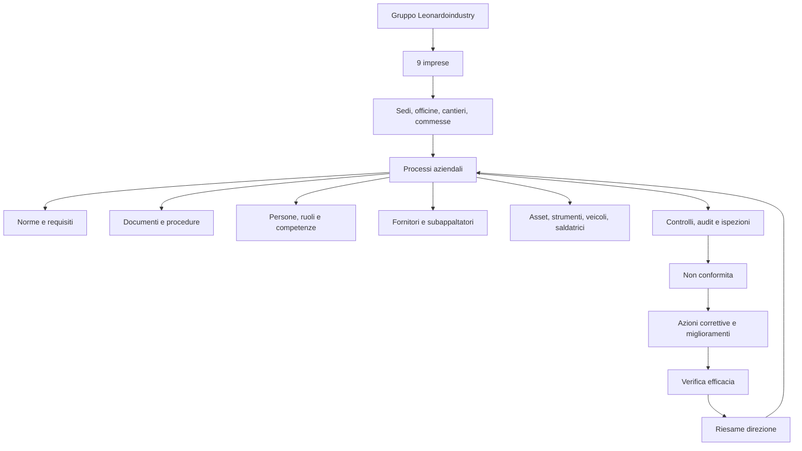
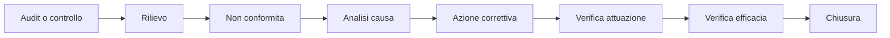
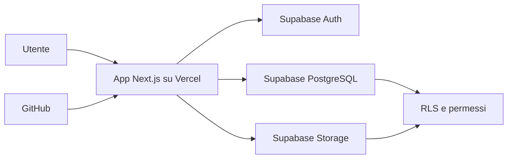

# Preambolo del progetto app qualita Leonardoindustry

## 1. Cosa vogliamo fare

Vogliamo creare una piattaforma digitale unica per gestire in modo ordinato, automatico e controllato il sistema qualita, sicurezza, ambiente e produzione del gruppo Leonardoindustry.

Il punto di partenza e l'attuale sistema documentale qualita, oggi composto da procedure, registri, file Excel, Word, PDF, evidenze, audit, non conformita, piani, certificati e documenti tecnici. Questo materiale contiene gia una base importante, ma deve essere trasformato da archivio di documenti a sistema gestionale vivo.

La nuova app dovra quindi permettere di:

- gestire il sistema integrato ISO 9001, ISO 45001 e ISO 14001;
- gestire il sistema UNE-EN 1090 per strutture metalliche, saldatura, FPC e marcatura CE;
- estendere la gestione a tutte le 9 imprese del gruppo Leonardoindustry;
- controllare documenti, revisioni, evidenze e obsoleti;
- gestire scadenze, reminder, allarmi ed escalation;
- collegare audit, non conformita, azioni correttive e verifiche di efficacia;
- gestire persone, formazione, competenze e qualifiche;
- gestire strumenti, attrezzature, veicoli, saldatrici e tarature;
- gestire fornitori, subappaltatori e relativi documenti;
- gestire commesse, cantieri, officine, controlli e dossier finali;
- creare dashboard per direzione, responsabili e operatori.

L'obiettivo non e semplicemente caricare file online. L'obiettivo e costruire un sistema che dica ogni giorno cosa e conforme, cosa manca, cosa sta per scadere, chi deve agire e quale evidenza dimostra che il lavoro e stato fatto correttamente.

## 2. Perche serve questa piattaforma

Un sistema qualita tradizionale basato su cartelle e documenti funziona finche rimane piccolo. Quando pero il sistema cresce, coinvolge piu imprese, piu cantieri, piu norme, piu responsabili e piu scadenze, il rischio aumenta:

- documenti duplicati o obsoleti;
- revisioni non controllate;
- scadenze dimenticate;
- audit preparati all'ultimo momento;
- azioni correttive aperte troppo a lungo;
- evidenze disperse;
- difficolta a dimostrare conformita durante audit o controlli cliente;
- saldature o attivita critiche eseguite senza verifica preventiva di qualifiche, WPS, WPQR, materiali o strumenti.

La piattaforma deve ridurre questi rischi con regole automatiche, collegamenti chiari e dashboard operative.

## 3. Principio guida

Ogni elemento del sistema deve rispondere a queste domande:

1. A quale impresa appartiene?
2. A quale sede, officina, cantiere o commessa si riferisce?
3. A quale processo appartiene?
4. Quale norma o requisito copre?
5. Quale procedura lo governa?
6. Chi e responsabile?
7. Quando scade o quando deve essere verificato?
8. Quale evidenza dimostra la conformita?
9. Se non e conforme, quale azione lo chiude?

Questa e la regola fondamentale dell'architettura logica.

## 4. Architettura logica proposta

La piattaforma deve essere costruita come sistema a livelli.

Questa architettura permette di vedere il sistema da diversi punti di vista:

- vista gruppo;
- vista singola impresa;
- vista processo;
- vista norma;
- vista commessa/cantiere;
- vista saldatura/UNE-EN 1090;
- vista scadenze;
- vista audit e non conformita;
- vista direzione.

## 5. I grandi blocchi della piattaforma

### 5.1 Gruppo, imprese e sedi

La piattaforma deve partire dalla struttura del gruppo:

- gruppo Leonardoindustry;
- 9 imprese;
- sedi operative;
- officine;
- magazzini;
- cantieri;
- commesse.

Ogni dato deve poter essere filtrato per impresa e, se necessario, per sede o cantiere.

### 5.2 Processi

I processi sono la spina dorsale del sistema. Le norme non devono essere gestite come documenti astratti, ma come requisiti collegati ai processi reali.

Processi principali:

- direzione e riesame;
- documentazione;
- rischi e opportunita;
- clienti e contratti;
- fornitori e subappalti;
- risorse umane e formazione;
- commesse e cantieri;
- produzione e controllo operativo;
- qualita e controlli;
- sicurezza;
- ambiente;
- infrastrutture e strumenti;
- emergenze e antincendio;
- incidenti;
- non conformita e azioni;
- audit;
- indicatori e obiettivi;
- UNE-EN 1090 e saldatura.

### 5.3 Norme e requisiti

Le norme da gestire sono:

- ISO 9001;
- ISO 45001;
- ISO 14001;
- UNE-EN 1090-1;
- UNE-EN 1090-2;
- norme collegate alla saldatura, come ISO 3834, ISO 9606, ISO 15614 e ISO 15609, se applicabili.

Ogni requisito deve essere collegato a:

- processo;
- documento/procedura;
- evidenza attesa;
- responsabile;
- stato di conformita.

### 5.4 Documenti ed evidenze

La piattaforma deve distinguere chiaramente:

- procedure attive;
- istruzioni operative;
- moduli;
- registri;
- certificati;
- disegni;
- rapporti di controllo;
- dossier;
- documenti esterni;
- documenti obsoleti.

Il documento non deve essere solo un file. Deve avere:

- codice;
- titolo;
- revisione;
- stato;
- processo;
- impresa;
- data emissione;
- data prossima revisione;
- approvatore;
- file collegato.

### 5.5 Scadenze, reminder e allarmi

La piattaforma deve avere un motore scadenze centrale.

Esempi:

- revisione documenti;
- audit;
- azioni correttive;
- formazione;
- visite mediche;
- qualifiche saldatori;
- WPS/WPQR;
- tarature strumenti;
- manutenzioni saldatrici;
- revisioni veicoli;
- estintori;
- valutazione fornitori;
- verifiche ambientali;
- simulazioni emergenza.

Colori logici:

- verde: completato/conforme;
- blu: pianificato;
- giallo: entro 30 giorni;
- arancione: entro 7 giorni;
- rosso: scaduto o non conforme;
- nero: blocco operativo grave.

### 5.6 Audit, non conformita e azioni

Audit, NC e azioni devono essere collegati in catena.

Regole:

- una NC non si chiude senza azione;
- una azione non si chiude senza verifica;
- una verifica deve dire se l'azione e efficace;
- se non e efficace, si riapre il ciclo.

### 5.7 Modulo UNE-EN 1090 e saldatura

Questo modulo e centrale per le attivita di strutture metalliche e saldatura.

La piattaforma deve gestire:

- classi di esecuzione EXC1, EXC2, EXC3, EXC4;
- controllo produzione di fabbrica, FPC;
- materiali e certificati;
- disegni e revisioni;
- WPS;
- WPQR;
- qualifiche saldatori;
- coordinamento saldatura;
- consumabili;
- saldatrici e strumenti;
- controlli visivi VT;
- controlli non distruttivi PT, MT, UT, RT;
- non conformita di saldatura;
- riparazioni;
- dossier CE.

Catena logica saldatura:

```mermaid
flowchart LR
  A["Commessa"] --> B["Classe EXC"]
  B --> C["Disegno approvato"]
  C --> D["Materiale certificato"]
  D --> E["WPS valida"]
  E --> F["WPQR collegata"]
  F --> G["Saldatore qualificato"]
  G --> H["Saldatrice/strumenti validi"]
  H --> I["Esecuzione saldatura"]
  I --> J["Controllo VT"]
  J --> K["CND se richiesto"]
  K --> L["Accettazione o NC"]
  L --> M["Dossier CE"]
```

Regola fondamentale:

Una saldatura non deve essere autorizzata se mancano WPS valida, WPQR collegata, saldatore qualificato, materiale identificato, disegno approvato o controlli previsti.

## 6. Architettura tecnica prevista

La piattaforma sara sviluppata con:

- GitHub per repository e versionamento;
- Vercel per pubblicazione e deploy;
- Supabase per database PostgreSQL, autenticazione, storage file e sicurezza;
- Next.js, TypeScript, Tailwind CSS e shadcn/ui per l'app web.

## 7. Perche questa architettura e corretta

Questa architettura permette di:

- partire velocemente;
- evitare un backend separato nella prima fase;
- avere autenticazione gia pronta;
- avere database relazionale forte;
- gestire file ed evidenze;
- pubblicare facilmente su Vercel;
- lavorare con versionamento GitHub;
- mantenere sicurezza tramite Row Level Security;
- scalare progressivamente verso moduli piu avanzati.

## 8. Primo risultato atteso

La prima versione della piattaforma deve consentire almeno:

- login;
- dashboard gruppo;
- gestione imprese;
- gestione processi;
- gestione documenti;
- gestione scadenze;
- gestione audit;
- gestione non conformita;
- gestione azioni;
- gestione persone e competenze;
- gestione asset;
- modulo base saldatura con WPS, WPQR, qualifiche saldatori, materiali, saldature e controlli.

## 9. Frase guida del progetto

La piattaforma deve trasformare il sistema qualita da archivio documentale a sistema operativo di controllo, prevenzione e miglioramento continuo per tutte le imprese del gruppo Leonardoindustry.

