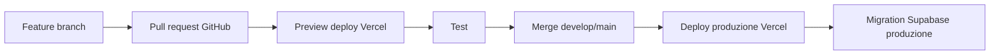

# Setup GitHub, Vercel e Supabase

## 1. GitHub

1. Creare repository GitHub.
2. Nome consigliato:
   - `leonardoindustry-quality-platform`
3. Branch:
   - `main`
   - `develop`
4. Proteggere `main`.
5. Ogni sviluppo deve passare da pull request.

## 2. Supabase

1. Creare progetto Supabase.
2. Regione consigliata: Europa, se i dati sono principalmente UE.
3. Salvare:
   - Project URL;
   - anon key;
   - service role key;
   - project ref;
   - database password.
4. Creare migrations.
5. Applicare schema iniziale.
6. Attivare RLS.
7. Creare bucket Storage:
   - `documents`
   - `evidence`
   - `welding`
   - `certificates`
   - `audit-reports`
   - `ce-dossiers`

## 3. Vercel

1. Collegare Vercel al repository GitHub.
2. Framework: Next.js.
3. Production branch: `main`.
4. Preview branch: ogni PR.
5. Configurare variabili ambiente.

Variabili:

```text
NEXT_PUBLIC_SUPABASE_URL=
NEXT_PUBLIC_SUPABASE_ANON_KEY=
SUPABASE_SERVICE_ROLE_KEY=
SUPABASE_PROJECT_REF=
DATABASE_URL=
```

Regola:

- `SUPABASE_SERVICE_ROLE_KEY` solo server-side.
- mai usarla in componenti client.

## 4. Ambienti

Creare tre livelli:

| Ambiente | Uso |
|---|---|
| Development | locale sviluppatore |
| Preview | test automatici da PR Vercel |
| Production | ambiente reale |

Idealmente usare due progetti Supabase:

- Supabase dev/staging;
- Supabase production.

## 5. Flusso sviluppo



## 6. Sicurezza minima

- RLS attiva.
- Bucket non pubblici.
- Signed URLs per file.
- Service role solo server.
- Log accessi importanti.
- Backup Supabase attivo.
- Separazione staging/produzione.

## 7. Primo rilascio

Il primo rilascio deve includere:

- login;
- dashboard;
- imprese;
- processi;
- documenti;
- scadenze;
- audit;
- NC;
- azioni;
- persone;
- asset;
- saldatura base.

