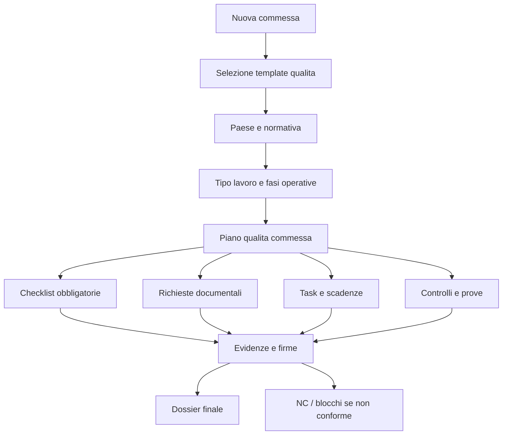
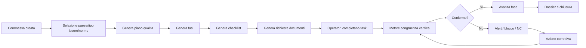

# Specifica modulo Quality Sentinel

## 1. Visione

La piattaforma qualita deve essere progettata come **Quality Control Operating System**, non come archivio documentale.

La sezione qualita deve diventare un modulo operativo obbligante, capace di guidare ogni operatore passo passo nella gestione qualita di:

- commessa;
- cantiere;
- produzione;
- officina;
- documentazione;
- controlli;
- prove;
- collaudi;
- chiusura lavori.

Nome del modulo: **Quality Sentinel**.

Quality Sentinel deve comandare, ricordare, bloccare, sollecitare, registrare e proteggere l'azienda.

Se non obbliga gli operatori a seguire il processo, non e qualita. E solo un archivio di documenti.

## 2. Principio operativo

Ogni attivita qualita deve essere gestita come flusso obbligato.

Il sistema deve sempre sapere:

- cosa deve essere fatto;
- chi lo deve fare;
- entro quando;
- con quale procedura;
- con quale checklist;
- con quali allegati obbligatori;
- con quale firma o approvazione;
- cosa succede se manca qualcosa;
- quando bloccare;
- quando generare NC;
- quando fare escalation.

## 3. Motore qualita per commessa

Ogni commessa deve avere un piano qualita dedicato generato da template configurabili.

Il template deve dipendere da:

- tipologia lavoro;
- cliente;
- paese: Italia, Spagna, altro;
- normativa applicabile;
- fase operativa;
- classe EXC, se UNE-EN 1090 applicabile;
- responsabile qualita;
- responsabile commessa;
- operatori coinvolti;
- fornitori/subappaltatori;
- sede/cantiere/officina.

Ogni piano qualita commessa deve generare:

- checklist;
- task;
- richieste documentali;
- scadenze;
- controlli;
- firme;
- dossier finale;
- eventuali blocchi.

## 4. Checklist obbligatorie

La piattaforma deve generare checklist automatiche per ogni fase:

- avvio commessa;
- verifica requisiti cliente;
- apertura cantiere/officina;
- ricezione materiali;
- controlli in cantiere;
- controlli in officina;
- prove e collaudi;
- gestione fornitori/subappaltatori;
- gestione non conformita;
- documentazione finale;
- chiusura lavori.

Ogni checklist deve avere:

- codice;
- titolo;
- fase;
- attivita da svolgere;
- responsabile;
- scadenza;
- allegati obbligatori;
- firma/conferma operatore;
- approvazione responsabile, se richiesta;
- stato;
- storico;
- collegamento a procedura;
- collegamento a norma/requisito.

Stati checklist:

- non_avviata;
- in_corso;
- bloccata;
- completata;
- scaduta;
- non_conforme;

Regole:

- una checklist con punti obbligatori incompleti non puo essere completata;
- una checklist scaduta deve comparire in dashboard;
- una checklist con punto critico non conforme deve generare NC;
- una checklist con allegato obbligatorio mancante deve restare bloccata.

## 5. Sistema di obbligo operativo

Quality Sentinel non deve suggerire: deve obbligare.

Esempi di blocco:

- se manca certificato materiale, bloccare avanzamento fase;
- se manca verbale collaudo, impedire chiusura attivita;
- se manca firma responsabile, generare alert e impedire approvazione;
- se checklist scaduta, evidenziare anomalia in dashboard;
- se fornitore ha documenti scaduti, bloccare assegnazione;
- se strumento e fuori taratura, bloccare controllo;
- se documento e obsoleto, impedirne uso;
- se saldatore ha qualifica scaduta, bloccare saldatura;
- se WPS/WPQR mancano, bloccare autorizzazione saldatura;
- se dossier finale incompleto, impedire chiusura commessa.

Livelli:

- warning: informazione forte ma non bloccante;
- alert: richiede azione;
- escalation: notifica responsabile superiore;
- block: impedisce avanzamento;
- NC gestionale: generata da ritardo o mancato rispetto processo.

## 6. Congruenza documentale

Implementare un motore di verifica documentale.

Il motore deve controllare:

- documenti mancanti;
- documenti scaduti;
- versioni obsolete;
- documenti caricati nel processo sbagliato;
- allegati caricati nel posto sbagliato;
- incongruenze tra documenti;
- certificati non compatibili con la commessa;
- certificati materiale non collegati al lotto;
- WPS non compatibile;
- WPQR non collegata;
- qualifica saldatore non coerente con processo;
- strumenti non validi alla data del controllo;
- documentazione incompleta per chiusura lavori.

Ogni controllo di congruenza deve produrre:

- esito;
- motivazione;
- gravita;
- suggerimento azione;
- eventuale task;
- eventuale blocco;
- eventuale NC.

## 7. Richieste automatizzate

Il sistema deve generare richieste automatiche verso:

- operatori interni;
- responsabili reparto;
- responsabili qualita;
- responsabili commessa;
- fornitori;
- subappaltatori;
- cliente;
- direzione lavori;
- auditor.

Ogni richiesta deve avere:

- oggetto;
- destinatario;
- motivazione;
- documento o attivita richiesta;
- deadline;
- priorita;
- stato;
- storico solleciti;
- allegati ricevuti;
- esito verifica.

Stati richiesta:

- bozza;
- inviata;
- ricevuta;
- in_verifica;
- accettata;
- respinta;
- scaduta;
- sollecitata;
- chiusa.

## 8. Alert, reminder e richiami

Sistema multilivello:

- T-7 giorni: promemoria;
- T-3 giorni: avviso;
- T-1 giorno: warning;
- scadenza superata: NC gestionale o task scaduto;
- oltre X giorni: escalation alla direzione.

Ogni sollecito deve essere registrato nello storico.

Canali possibili:

- notifica in app;
- email;
- futura integrazione Teams/WhatsApp, se richiesta;
- dashboard;
- report criticita.

## 9. Dashboard Quality Sentinel

Creare dashboard dedicata con:

- qualita per commessa;
- checklist aperte;
- checklist scadute;
- documenti mancanti;
- documenti scaduti;
- documenti non congruenti;
- non conformita;
- scadenze prossime;
- operatori in ritardo;
- fornitori non conformi;
- blocchi operativi;
- stato chiusura documentale;
- indice qualita commessa;
- trend qualita per impresa;
- commesse non chiudibili.

### Indice qualita commessa

Calcolare un punteggio sintetico da 0 a 100.

Esempio logica:

- checklist completate;
- documenti obbligatori presenti;
- assenza NC aperte;
- scadenze rispettate;
- firme presenti;
- controlli superati;
- dossier finale completo.

Se indice sotto soglia, mostrare alert.

## 10. Memoria obbligata

Ogni evento qualita deve restare tracciato:

- chi ha fatto cosa;
- quando;
- con quale documento;
- con quale revisione;
- con quale esito;
- chi ha approvato;
- quali solleciti sono stati inviati;
- quali blocchi sono stati generati;
- quali allegati sono stati caricati;
- quali modifiche sono state fatte;
- da chi;
- quando.

Nessuna modifica deve sparire.

Serve storico audit completo.

## 11. Coach operativo

La piattaforma deve parlare all'utente in modo operativo.

Esempi messaggi:

- "Oggi devi fare questi controlli."
- "Questa commessa non puo avanzare perche manca il certificato materiale."
- "Questo fornitore non ha caricato il certificato richiesto."
- "Hai 3 checklist in ritardo."
- "Per chiudere questa fase mancano 2 firme e 1 allegato."
- "La WPS selezionata non e compatibile con il materiale."
- "La qualifica del saldatore scade tra 7 giorni."
- "Questa NC non puo essere chiusa senza verifica efficacia."

## 12. Normative per paese

Il sistema deve distinguere le regole qualita per paese:

- Italia;
- Spagna;
- altri paesi futuri.

Ogni template qualita deve poter essere collegato a:

- paese;
- normativa nazionale;
- obbligo legale;
- requisito cliente;
- requisito ISO/UNE.

Non usare una logica unica generica.

## 13. Ruoli e autorizzazioni

Profili minimi:

- operatore;
- responsabile qualita;
- responsabile commessa;
- direzione;
- fornitore/subappaltatore;
- auditor;
- cliente/DL in sola lettura, se necessario.

Regole:

- operatore compila solo checklist assegnate;
- responsabile qualita approva e gestisce NC;
- responsabile commessa vede stato qualita della commessa;
- direzione vede criticita ed escalation;
- fornitore carica solo documenti richiesti;
- auditor vede audit e evidenze;
- cliente/DL vede solo dossier o documenti autorizzati.

## 14. Non conformita

Gestione completa:

- apertura NC;
- origine;
- classificazione;
- gravita;
- responsabile;
- causa;
- correzione immediata;
- azione correttiva;
- azione preventiva;
- allegati;
- verifica efficacia;
- chiusura approvata.

Regole:

- NC scaduta genera escalation;
- NC grave blocca chiusura commessa;
- NC tecnica saldatura blocca dossier CE;
- NC gestionale puo nascere da task o checklist scaduta;
- NC non puo chiudersi senza verifica efficacia.

## 15. Tabelle dati consigliate

Aggiungere o verificare queste entita:

- `quality_template`
- `quality_template_phase`
- `quality_template_checklist`
- `quality_plan`
- `quality_plan_phase`
- `quality_checklist`
- `quality_checklist_item`
- `quality_request`
- `quality_document_requirement`
- `quality_document_check`
- `quality_block`
- `quality_event_log`
- `quality_score`
- `country_rule`
- `national_requirement`

## 16. Workflow essenziale

## 17. Criterio di successo

Quality Sentinel e riuscito solo se:

- l'utente sa sempre cosa deve fare;
- i responsabili vedono subito cosa manca;
- le commesse non avanzano senza requisiti minimi;
- i documenti sbagliati vengono intercettati;
- i ritardi generano richiami;
- le NC vengono chiuse con verifica;
- il sistema lascia memoria completa;
- la direzione vede criticita e rischi in tempo reale.

In sintesi:

**la qualita non deve essere una cartella dove caricare PDF. Deve essere un sistema che comanda, ricorda, blocca, sollecita, registra e protegge l'azienda.**

## 18. Quality Intelligence Live

Quality Sentinel deve essere integrato con il layer definito in:

- `specifica_dashboard_live_quality_intelligence.md`
- `specifica_interazioni_live_notifiche_mobile.md`

La direzione non deve leggere centinaia di format per capire se il gruppo lavora bene. Deve avere grafici, indici, feed live, prove fotografiche e controlli di congruenza.

Un format compilato senza evidenza reale non deve pesare come qualita piena.

Il sistema deve misurare:

- puntualita;
- correttezza;
- completezza;
- corrispondenza documentale;
- evidenze live;
- foto dal campo;
- blocchi;
- NC;
- comportamento operatori e fornitori.

Inoltre deve essere vivo: popup, notifiche, messaggi su telefono e palmari devono raggiungere gli utenti nel momento giusto. L'utente non deve scoprire un problema solo entrando in una tabella.
